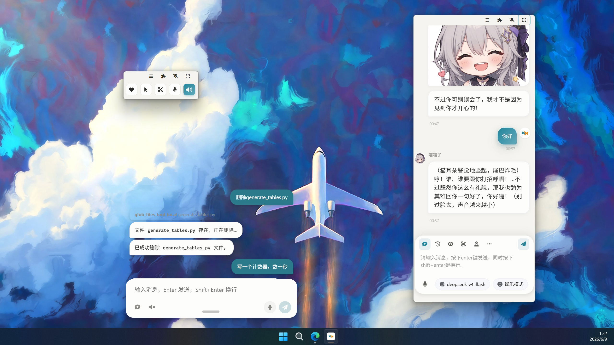

<div align="center">
  <a href="./README_ZH.md">
    
  </a>
  <a href="./README.md">
    
  </a>
  <a href="./README_JA.md">
    
  </a>
</div>

####

<p align="center">
  <a href="https://trendshift.io/repositories/16259" target="_blank">
    
  </a>
</p>

####

<div align="center">
  <a href="https://www.agentparty.top/"></a>
  <a href="https://www.agentparty.top/blog.html"></a>
  <a href="https://space.bilibili.com/26978344"></a>
  <a href="https://www.youtube.com/@LLM-party"></a>
  <a href="https://gcnij7egmcww.feishu.cn/wiki/DPRKwdetCiYBhPkPpXWcugujnRc"></a>
  <a href="https://temporal-lantern-7e8.notion.site/super-agent-party-211b2b2cb6f180c899d1c27a98c4965d"></a>
  <a href="#クイックスタート"></a>
</div>

## はじめに

### 🚀 **無限の可能性を秘めたAIデスクトップコンパニオン！**

#### デスクトップコンパニオン：カスタムVRMモデル、アクション、3Dシーンをサポートし、[live2D拡張](https://github.com/heshengtao/sap-live2d)にも対応しています。


#### Link VTS: Vtube StudioでLive2Dモデルを制御し、カスタムアクションや表情コントロールをサポート


#### 高自由度チャットインターフェース：背景画像のカスタマイズ、スタンプ、キャラクター設定、THAベースの2Dキャラクターイメージ、キャラクターMCPツールにより、より没入感のあるチャットを実現


#### タスクセンター：AIエージェントにバックグラウンドで高度なタスクを実行させ、自動的にコンピュータを制御して作業を完了させます。MCPとAgent Skillsに対応。


#### コンピューター制御：デスクトップの視覚情報と、マウス、キーボード、ターミナルの三方向からの制御ツールチェーンを組み合わせることで、AIエージェントがコンピューター上であらゆるタスクを遂行できるようになります！下の画像は、AIがWordleをプレイしている様子です。


#### 複数のウィンドウモード：チャットインターフェースはスマートフォンサイズやカプセルサイズでデスクトップにドッキング可能


#### マルチロールグループチャット：タバーンキャラクターカードと長期記憶に対応し、複数のキャラクターと同時にチャットできます！


#### インスタントメッセージングBot：QQ、WeChat、Feishu、DingTalk、Telegram、Discord、Slackへのワンクリックデプロイに対応


#### ライブ配信Bot：Bilibili、YouTube、Twitchへのワンクリックデプロイに対応し、360度パノラマライブ配信も可能。


#### AIブラウザ：AIエージェントに専用ブラウザを装備し、自動制御に対応


#### 拡張機能システム：拡張機能のインストールと新規作成に対応。下の画像はギャルゲー拡張機能です。すべての拡張機能は独立ウィンドウまたはサイドバーで開くことができます。あなたは[sap-extension-creator](skills/sap-extension-creator)というエージェントスキルを使って、新しいSAP拡張を作成し、エージェントパーティのブートストラップを実現することもできます！


#### 開発者フレンドリー：オープンなOpenAI APIインターフェースとMCPインターフェースを提供し、エージェントの外部接続が可能


## クイックスタート

### CLIエージェントの場合

CLIエージェントは[README_AGENT.md](https://raw.githubusercontent.com/heshengtao/super-agent-party/main/README_AGENT.md)のドキュメントを確認してください。このドキュメントを参考に、ユーザーに本ソフトウェアのインストールを案内してください！

### CLIエージェントを使用する人間の場合

このリンクをAIに送信すると、AIが本ソフトウェアのインストールを案内します！

```
curl -fsSL https://raw.githubusercontent.com/heshengtao/super-agent-party/main/README_AGENT.md
```

### Windowsポータブルパッケージ（推奨！インストール不要のソースバージョン、最新リポジトリへのワンクリック同期対応、デスクトップ版のパッケージングを待つ必要なし）

  👉 [ダウンロードはこちら](https://github.com/heshengtao/super-agent-party/releases/download/v0.4.2/super-agent-party-win-v0.4.2.zip)

⭐ 注意！ `一键更新(update).bat` をダブルクリックしてソフトウェアを更新するか、`一键启动(start).bat` をダブルクリックしてソフトウェアを起動できます。OSは **Windows 10/11、Windows Server 2025** 以降が必要です！

### Windowsデスクトップインストール

  👉 [ダウンロードはこちら](https://github.com/heshengtao/super-agent-party/releases/download/v0.4.2/Super-Agent-Party-Setup-0.4.2.exe)

⭐ 注意！ インストール時に「現在のユーザーのみにインストール」を選択してください。そうしないと、起動時に管理者権限が必要になります。OSは **Windows 10/11、Windows Server 2025** 以降が必要です！

### MacOS 統合パッケージ（現在はMチップのみ対応、インストール不要のソースコード版、ワンクリックでリポジトリ最新版に同期可能、デスクトップ版のパッケージ化待ち不要）
> **開発者/上級ユーザー向け**：インストール不要のソースコード版、ワンクリックでリポジトリ最新版に同期可能、デスクトップ版のパッケージ化待ち不要。

👉 [国際ユーザーはこちらをクリックしてダウンロード](https://github.com/heshengtao/super-agent-party/releases/download/v0.4.2/super-agent-party-mac-v0.4.2.zip) 

#### 🚀 使用方法

**1. ネットワークダウンロード隔離を解除（重要）**
ダウンロードして解凍後、ターミナルを開き、以下のコマンドを入力し（最後のスペースに注意）、**解凍したフォルダ**をターミナルウィンドウにドラッグ＆ドロップしてEnterキーを押します：
```shell
sudo xattr -rd com.apple.quarantine 
```
*(注：`-rd` パラメータはフォルダ内のすべてのコンポーネントの隔離属性を再帰的に削除します。これを行わないとPython環境が正常に呼び出せない可能性があります)*

**2. スクリプトに実行権限を付与**
ターミナルで該当フォルダに移動し、以下を実行：
```shell
chmod +x 一键更新(update).sh 一键启动(start).sh
```

**3. ソフトウェアを実行**
- **初回使用/更新時：** まず `./一键更新(update).sh` を実行し、依存関係が最新版に同期されていることを確認することをお勧めします。
- **日常的な起動：** 直接 `./一键启动(start).sh` を実行します。

### macOSデスクトップインストール（現在Mチップのみ対応）

  👉 [ダウンロードはこちら](https://github.com/heshengtao/super-agent-party/releases/download/v0.4.2/Super-Agent-Party-0.4.2-Mac.dmg)

⭐ 注意！ ダウンロード後、dmgファイルのアプリを `/Applications` ディレクトリにドラッグしてください。その後、ターミナルを開き、以下のコマンドを実行してルートパスワードを入力し、ネットワークダウンロードに付与されたQuarantine属性を削除してください：

  ```shell
  sudo xattr -dr com.apple.quarantine /Applications/Super-Agent-Party.app
  ```

### Linuxデスクトップインストール

👉 [Linux-AppImage-X86_64](https://github.com/heshengtao/super-agent-party/releases/download/v0.4.2/Super-Agent-Party-0.4.2-Linux-x86_64.AppImage)

👉 [Linux-AppImage-Arm64](https://github.com/heshengtao/super-agent-party/releases/download/v0.4.2/Super-Agent-Party-0.4.2-Linux-arm64.AppImage)

### Dockerデプロイ（このバージョンのデスクトップペットはブラウザからのみ閲覧できます。）

- 2つのコマンドでインストール：
  ```shell
  docker pull ailm32442/super-agent-party:latest
  docker run -d -p 3456:3456 -v ./super-agent-data:/app/data ailm32442/super-agent-party:latest
  ```

- ⭐注意！ `./super-agent-data` は任意のローカルフォルダに置き換えることができます。Docker起動後、すべてのデータはこのローカルフォルダにキャッシュされ、どこにもアップロードされません。

- 使用準備完了：http://localhost:3456/ にアクセス

### Docker Composeデプロイ（このバージョンのデスクトップペットはブラウザからのみ閲覧できます。ログイン管理用に追加のゲートウェイコンテナが起動されます。）

- プロジェクトのインストール：

  ```shell
  git clone https://github.com/heshengtao/super-agent-party.git
  cd super-agent-party
  docker-compose up -d
  ```

- ⭐注意！ デフォルトのユーザー名は `root`、デフォルトのパスワードは `pass` です。初回ログイン後にパスワードを変更してください。

- 使用準備完了：http://localhost:3456/ にアクセス

- APIキー管理：http://localhost:3456/token.html にアクセス

### Docker版に対応するLiteクライアント（Dockerをデスクトップアプリに変換）

👉 [SAP-lite-Windows-exe](https://github.com/heshengtao/desktop-for-sap/releases/download/v0.1.2/super-agent-party-lite-Setup-0.1.2.exe)

👉 [SAP-lite-MacOS-dmg](https://github.com/heshengtao/desktop-for-sap/releases/download/v0.1.2/super-agent-party-lite-0.1.2-Mac.dmg)

### ソースコードデプロイ

  ```shell
  git clone https://github.com/heshengtao/super-agent-party.git
  cd super-agent-party
  uv sync
  npm install
  npm run dev
  ```

## 拡張機能

全く新しい拡張機能システムが追加されました。[プラグインリスト](https://super-agent-party.github.io/plugins.html)で利用可能なプラグインを確認するか、Party内の【開発者】→【拡張機能】で直接確認・インストールできます。また、[super-agent-party.github.io](https://github.com/super-agent-party/super-agent-party.github.io)で自作の拡張機能を公式プラグインリストに追加することもできます！

### 既存の拡張機能

| 名前                  | 作者            | 説明                                                        | リポジトリURL                                   |
|-----------------------|-------------------|--------------------------------------------------------------------|--------------------------------------------------|
| Super Agent Party Example | heshengtao        | Super Agent Partyのサンプルプラグイン。プラグインのアーキテクチャと機能をデモンストレーション。 | https://github.com/heshengtao/sap-example        |
| Super Agent Party Example With NodeJS | heshengtao        | NodeJS環境を使用したチャットフロントエンドのサンプル | https://github.com/heshengtao/sap-example-with-node        |
| Web Preview           | heshengtao        | Super Agent PartyにWebプレビュー機能を追加するプラグイン。 | https://github.com/heshengtao/sap-web-preview    |
| Story Adventure       | heshengtao | AIを使用してストーリーコンテンツと選択肢を生成するインタラクティブなストーリーアドベンチャープラグイン。 | https://github.com/heshengtao/sap-story-adventure |
| Live 2D      | heshengtao  | Live 2D拡張機能                   | https://github.com/heshengtao/sap-live2d  |
| AI Editor      | heshengtao  | AIエディター       | https://github.com/heshengtao/sap-aieditor  |
| AI galgame      | heshengtao  | AIギャルゲー拡張機能     | https://github.com/heshengtao/sap-aigalgame  |
| AI tarot reader      | heshengtao  | AIタロットリーダー拡張機能      | https://github.com/heshengtao/sap-tarot  |
| AI sheet      | heshengtao  | AIスプレッドシート拡張機能                | https://github.com/heshengtao/sap-ai-sheet  |
| AI drawio      | heshengtao  | AI drawio拡張機能                 | https://github.com/heshengtao/sap-ai-drawio  |
| AI mermaid      | heshengtao  | AI Mermaidエディター拡張機能                  | https://github.com/heshengtao/sap-ai-mermaid  |
| AI RSS reader      | heshengtao  | Super Agent Party用のAI RSSリーダー拡張機能      | https://github.com/heshengtao/sap-rss  |
| Remote      | heshengtao  | Super Agent Partyをワンクリックでインターネットに公開             | https://github.com/heshengtao/sap-remote  |
| Code Server      | heshengtao  | Super Agent Party用のIDE拡張機能          | https://github.com/heshengtao/sap-code-server  |
| CLI      | heshengtao  |  Super Agent Party用CLI拡張機能          | https://github.com/heshengtao/sap-cli  |
| LX-music      | heshengtao  | super agent party を LX Music API に接続し、AI パートナーが音楽再生を操作できるようにします！ | https://github.com/heshengtao/sap-lx-music  |
| AI PPT      | heshengtao  | Super Agent Party 向けの AI PPT 拡張プラグイン          | https://github.com/heshengtao/sap-ai-ppt  |
| Lyra 星莱      | heshengtao  | 星空魔法使いリラのキャラクター拡張 — キャラカード、THAモデル、スタンプ、背景をワンクリックでインストール | https://github.com/heshengtao/sap-lyra-extension  |

## ハードウェア要件

- CPU：2コア以上
- メモリ：2GB以上

**すべてのモデルはオプションであり、ローカルデプロイメントエンジンにアクセスするか、すべてクラウドサービスプロバイダーのインターフェースを使用できるため、ハードウェア要件はほとんどありません。2コア2GBのクラウドサーバーでDocker版をテストし、問題なく動作することを確認しています。**

## 使い方

- デスクトップ：デスクトップアイコンをクリックするだけで使用できます。

- WebまたはDocker：起動後に http://localhost:3456/ にアクセスしてください。

- API呼び出し：開発者フレンドリーで、OpenAI形式に完全互換。リアルタイム出力が可能で、元のAPIの応答速度に影響しません。呼び出しコードの変更は不要です：

  ```python
  from openai import OpenAI
  client = OpenAI(
    api_key="super-secret-key",
    base_url="http://localhost:3456/v1"
  )
  response = client.chat.completions.create(
    model="super-model",
    messages=[
        {"role": "user", "content": "Super Agent Partyとは何ですか？"}
    ]
  )
  print(response.choices[0].message.content)
  ```

- MCP呼び出し：起動後、設定ファイルに以下の内容を記述してローカルMCPサービスを呼び出すことができます：

  ```json
  {
    "mcpServers": {
      "super-agent-party": {
        "url": "http://127.0.0.1:3456/mcp"
      }
    }
  }
  ```

## 機能一覧

主な機能については以下のドキュメントを参照してください：
  - 👉 [中国語ドキュメント](https://gcnij7egmcww.feishu.cn/wiki/DPRKwdetCiYBhPkPpXWcugujnRc)
  - 👉 [英語ドキュメント](https://temporal-lantern-7e8.notion.site/super-agent-party-211b2b2cb6f180c899d1c27a98c4965d)

| 機能 | 詳細 |
| --- | --- |
| 対応モデルサービスプロバイダー | openai/ollama/difyなど、一般的なローカルデプロイメントエンジンインターフェースとクラウドサービスプロバイダーインターフェースに対応。 |
| マルチモーダルモデル統合 | ロールプレイ、推論、画像認識、画像生成、音声認識、音声合成など、さまざまなタイプのモデルを統合して組み合わせて使用。 |
| VRMデスクトップペットロボット | カスタムアバター、カスタムアニメーション、音声インタラクション、対話中断に対応する高度にカスタマイズ可能なペット。OBSなどの画面録画ソフトウェアに透過的にストリーミング可能で、双方向VMCプロトコルに対応！ |
| THAデスクトップペットロボット | Live2Dスタイルの音声駆動口形アニメーション、リアルタイム音声合成と対話中断、透明ウィンドウでOBSに重ねて配信可能！ |
| Vtube Studioボット | Vtube StudioのLive2Dモデルを制御し、リアルタイム表情同期、カスタムアニメーション、音声インタラクションに対応！ |
| メッセージングプラットフォームBot | 現在QQ、WeChat、Feishu、Telegram、Discord、Slackに対応。今後さらにプラットフォームを追加予定。 |
| ライブ配信Bot | 現在Bilibili、YouTube、Twitchに対応。今後さらにプラットフォームを追加予定。 |
| アナウンサーBot | 長文ナレーション、マルチボイスナレーション、デジタルヒューマンビデオナレーション、超長文テキストの一括音声変換（ダウンロード機能付き）、EPUBなどの一般的な電子書籍フォーマットの解析に対応。チャプターベースの変換は今後開発予定。 |
| チャットインターフェース | チャットインターフェースはA2UI、数式、Mermaidダイアグラム、HTMLコードグラフィックスなどのフロントエンドレンダリング機能に対応。画像のダウンロードとコピーが可能。カプセルモードとアシスタントモードに対応し、会話インターフェースの縮小とドッキングが簡単。デスクトップビジョンとスクリーンショットと組み合わせて、仕事とエンターテイメントにシームレスに統合。 |
| ロールプレイ | タバーンキャラクターカードのアップロード、編集、ダウンロードに対応。キャラクターごとに異なる音声とアバターを設定可能。長期記憶、キャラクターカード使用時のマルチボイス対応、非キャラクターテキスト用のナレーター音声、絵文字とミームに対応。 |
| 豊富なネイティブツール | ツール呼び出しは非同期実行に対応。Web検索、ナレッジベースアクセス、スマートホーム制御、ブラウザ制御、サンドボックス環境でのコード実行、ComfyUIを制御した画像生成、Claude codeによるファイルシステム操作に対応。 |
| カスタムツールインターフェース | MCP、Skills、A2A、HTTPリクエスト、および任意のLLMインターフェースをメインエージェントのツールとして使用可能。ユーザーがエージェントのツールチェーンを自由にカスタマイズ可能。 |
| オープン外部API | OpenAIとMCPをシミュレートするオープンAPI、およびデスクトップペットAPIを備えた開発者フレンドリーな設計。 |
| 拡張機能システム | [拡張機能リスト](https://super-agent-party.github.io/plugins.html)で利用可能なプラグインを確認できます。Party内の【開発者】→【拡張機能】で直接プラグインの確認とインストールも可能。[super-agent-party.github.io](https://github.com/super-agent-party/super-agent-party.github.io)で自作の拡張機能を公式リストに追加できます！ |

## 免責事項：
このオープンソースプロジェクトとそのコンテンツ（以下「プロジェクト」）は参考用であり、明示的または暗示的な保証を意味するものではありません。プロジェクトの貢献者は、プロジェクトの完全性、正確性、信頼性、または適用性について一切の責任を負いません。プロジェクトのコンテンツに依存する行為は、ユーザー自身の責任において行われるものとします。いかなる場合も、プロジェクトの貢献者は、プロジェクトのコンテンツの使用により生じた間接的、特別、または偶発的な損失または損害について責任を負いません。

## 特記事項
1. このオープンソースプロジェクトの特定の機能（例えばEdge TTS音声合成など）は、サードパーティサービスが提供するパブリックインターフェースまたは実験的機能に依存しています。これらの機能は、サードパーティのポリシー変更により、いつでも利用できなくなる可能性があります。開発者はそれらの安定性、合法性、または継続性について一切の責任を負いません。このプロジェクトを使用することにより、ユーザーは関連するリスクを理解し、受け入れたものとみなされます。開発者は、これらの機能を商用または大規模デプロイメントシナリオで使用することを推奨しません。

2. QQ Botは公式QQ Botインターフェースを使用しています。[AIGC QQ Bot使用ガイドライン](https://q.qq.com/#/news/detail?id=1376238e8e2fbbc036676bb09d2f37da)を遵守してください。

3. このプロジェクトで提供されるブラウザ制御機能は、大規模言語モデル（LLM）に基づくアクセシビリティ支援ブラウジングインターフェースです。視覚障害者、高齢者、または身体に課題のある方が自然言語コマンドを通じてブラウザをより便利に操作できるよう、AI視覚認識技術を活用して設計されています。自動クローリングやハッキング目的ではありません。本プロジェクトは「LLM視覚推論→単一ステップ操作」の技術アーキテクチャを採用しています。アクセシビリティ支援ブラウジングインターフェースには以下の特徴があります：
   a. 高頻度の同時実行なし：LLMの推論速度（1ステップあたり3〜5秒）と組み込みのランダム化された人間らしい遅延アルゴリズムに依存しているため、ツールの操作頻度は一般的な人間ユーザーの最大手動速度を厳密に下回ります。
   b. サーバーへの負荷なし：このツールはマルチスレッドの同時実行、バッチデータスクレイピング、またはDDoS攻撃をサポートしていません。サーバーの観点から見ると、その動作は通常の人間ユーザーの動作と区別がつかず、対象ウェブサイトのサーバーに追加の負荷をかけることはありません。

4. このプロジェクトを銀行、決済ゲートウェイ、または機密性の高い情報ページで使用しないでください。開発者は、ユーザーの不適切な操作により生じたプライバシー侵害について責任を負いません。禁止される行為には、大規模データスクレイピング、セキュリティメカニズムの回避、ネットワーク妨害、法律・規制違反が含まれます。

5. このプロジェクトは独自に開発されたオープンソースツールです。ユーザーがこのソフトウェアを使用してサードパーティのAPIサービスにアクセスする場合、関連するサービスプロバイダーの利用規約を遵守する責任はユーザーにあります。

6. このソフトウェアがサードパーティの大規模モデルを通じて生成したコンテンツの正確性、完全性、およびコンプライアンスについては、モデルプロバイダーとユーザーの行為が責任を負います。本ソフトウェアの作者は、そのようなコンテンツに対して法的責任を負いません。

## ライセンス契約

このプロジェクトはデュアルライセンスモデルを採用しています：
1. デフォルトでは、このプロジェクトは **GNU Affero General Public License v3.0 (AGPLv3)** ライセンス契約に従います。
2. このプロジェクトをクローズドソースの商用目的で使用する場合は、プロジェクト管理者から商用ライセンスを取得する必要があります。ビジネス協力：hst97@qq.com

書面による許可なくこのプロジェクトをクローズドソースの商用目的で使用することは、この契約の違反とみなされます。AGPLv3の全文は、プロジェクトルートディレクトリのLICENSEファイルまたは[gnu.org/licenses](https://www.gnu.org/licenses/agpl-3.0.html)で確認できます。

### サードパーティライセンス通知

このプロジェクトには、メインプロジェクトのライセンスとは異なるライセンスを持つサードパーティのライブラリまたはコンポーネントが含まれている場合があります。関連するライセンス要件を遵守するため、プロジェクトのルートディレクトリにある[LICENSE-third-party](./LICENSE-third-party)フォルダ、または対応するコンポーネントのソースコード内でこれらのサードパーティコンポーネントのライセンス情報を確認できます。

すべてのサードパーティライブラリおよびコンポーネントの貢献者に感謝し、ライセンス条項を尊重することをお約束します。

## サポート：

### スターをお願いします！
⭐あなたのサポートが私たちの前進の原動力です！

<div align="center">
  
</div>

### 投げ銭をお願いします！
<div align="center" style="display: flex; gap: 20px; justify-content: center; flex-wrap: wrap;">

[](https://ko-fi.com/agentparty)
[](https://afdian.com/a/agentparty)

</div>

### フォローしてください
<div align="center">
  <a href="https://space.bilibili.com/26978344">
    
  </a>
  <a href="https://www.youtube.com/@agentParty">
    
  </a>
</div>

<div align="center">
  <a href="https://www.youtube.com/watch?v=fIzlQOsuhZE" target="_blank">
    
  </a>
</div>

### コミュニティに参加
プロジェクトに関する質問や問題がありましたら、コミュニティへの参加を歓迎します。

1. QQグループ：`931057213`（1群已满） `902882342`（2群）

<div style="display: flex; justify-content: center;">
    
</div>

2. Discord：[Discordリンク](https://discord.gg/f2dsAKKr2V)

## コントリビューター

<a href="https://github.com/heshengtao/super-agent-party/graphs/contributors">
  
</a>

## Star履歴

[](https://www.star-history.com/#heshengtao/super-agent-party&Date)
