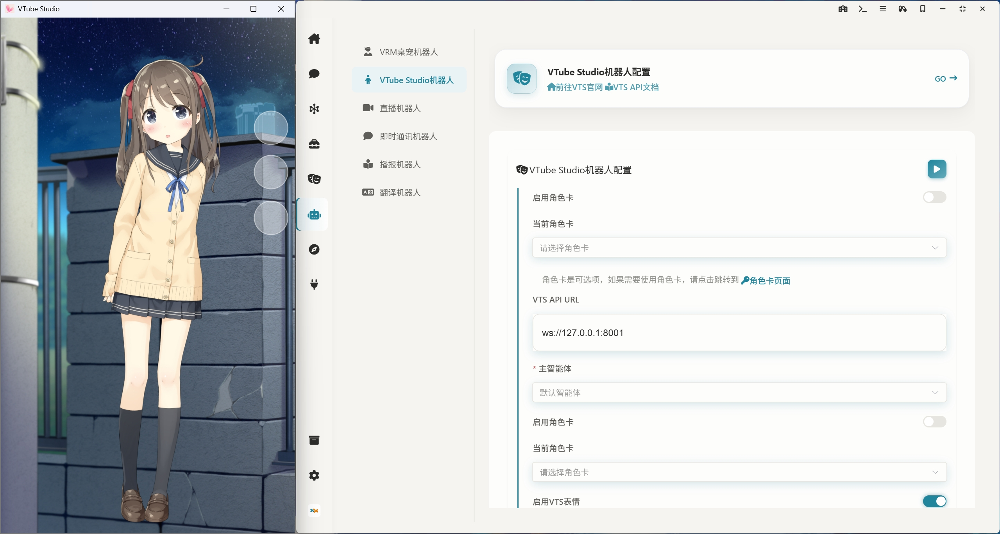

<div align="center">
  <a href="./README_ZH.md">
    
  </a>
  <a href="./README.md">
    
  </a>
  <a href="./README_JA.md">
    
  </a>
</div>

####

<p align="center">
  <a href="https://trendshift.io/repositories/16259" target="_blank">
    
  </a>
</p>

####

<div align="center">
  <a href="https://www.agentparty.top/"></a>
  <a href="https://www.agentparty.top/blog.html"></a>
  <a href="https://space.bilibili.com/26978344"></a>
  <a href="https://www.youtube.com/@LLM-party"></a>
  <a href="https://gcnij7egmcww.feishu.cn/wiki/DPRKwdetCiYBhPkPpXWcugujnRc"></a>
  <a href="https://temporal-lantern-7e8.notion.site/super-agent-party-211b2b2cb6f180c899d1c27a98c4965d"></a>
  <a href="#快速开始"></a>
</div>

## 简介

### 🚀 **一款拥有无限可能的AI桌面伴侣！**

#### 桌面伴侣：支持自定义VRM模型、动作、3D场景，并支持[live2D扩展](https://github.com/heshengtao/sap-live2d)


#### 链接VTS：控制Vtube studio中的live2d模型，支持自定义动作和表情控制


#### 任务中心：让你的AI智能体可以在后台执行任何高级任务，自动控制电脑帮你干活，支持 MCP 和 Agent Skills


#### 电脑控制：通过桌面视觉加上对鼠标、键盘、终端三方面的控制工具链，让AI智能体可以在电脑上完成任何任务！下图为AI在玩Wordle


#### 多角色群聊：支持酒馆角色卡，支持长期记忆，你可以同时和多个角色一起聊天！


#### 即时通讯机器人：支持一键部署到QQ、微信、飞书、钉钉、Telegram、Discord、Slack


#### 直播机器人：支持一键部署到B站、YouTube、twitch，支持360度全景直播


#### AI浏览器：让你的AI智能体拥有自己的浏览器，支持自动控制


#### 扩展系统：支持安装扩展，和自己创造新的扩展，下图为galgame扩展，扩展均支持独立窗口或者侧边栏两种方式打开


#### 开发者友好：开放openai API接口、MCP接口，可以将智能体对外转接


## 快速开始

### 中国用户下载请点击 **中国用户点击下载** 的链接！

### 如果你是CLI Agent

CLI Agent需要查看[README_AGENT.md](https://raw.githubusercontent.com/heshengtao/super-agent-party/main/README_AGENT.md)的文档。请参考这个文档引导用户安装本软件！

### 如果你是使用CLI Agent的人类

将这个链接发给你的AI，AI会引导你安装本软件！

```
https://raw.githubusercontent.com/heshengtao/super-agent-party/main/README_AGENT.md
```

### windows整合包（推荐！免安装源码版本，支持一键同步到仓库最新版本，无需等待桌面版打包）

  👉 [国际用户点击下载](https://github.com/heshengtao/super-agent-party/releases/download/v0.4.1/super-agent-party-win-v0.4.1.zip)

  👉 [中国用户点击下载](https://modelscope.cn/models/ailm32442/super-agent-party-portable/resolve/master/v0.4.1/super-agent-party-win-v0.4.1.zip)


⭐注意！你可以双击`一键更新(update).bat`更新软件，也可以双击`一键启动(start).bat`启动软件。操作系统需要是**Windows 10/11、Window Server 2025**或者后续版本！

### windows桌面版安装

👉 [国际用户点击下载](https://github.com/heshengtao/super-agent-party/releases/download/v0.4.1/Super-Agent-Party-Setup-0.4.1.exe)

👉 [中国用户点击下载](https://modelscope.cn/models/ailm32442/super-agent-party-portable/resolve/master/v0.4.1/Super-Agent-Party-Setup-0.4.1.exe)

⭐注意！安装时选择仅为当前用户安装，否则启动时需要管理员权限。操作系统需要是**Windows 10/11、Window Server 2025**或者后续版本！

### MacOS 整合包（目前只支持 M 芯片，免安装源码版本，支持一键同步到仓库最新版本，无需等待桌面版打包）

> **适合开发者/进阶用户**：免安装源码版本，支持一键同步到仓库最新版本，无需等待桌面版打包。

👉 [国际用户点击下载](https://github.com/heshengtao/super-agent-party/releases/download/v0.4.1/super-agent-party-mac-v0.4.1.zip)  

👉 [中国用户点击下载](https://modelscope.cn/models/ailm32442/super-agent-party-portable/resolve/master/v0.4.1/super-agent-party-mac-v0.4.1.zip)

#### 🚀 使用步骤

**1. 移除网络下载隔离（重要）**
下载并解压后，打开终端，输入以下命令（注意最后有一个空格），然后将**解压后的文件夹**拖入终端窗口并回车：
```shell
sudo xattr -rd com.apple.quarantine 
```
*(注：`-rd` 参数会递归移除文件夹内所有组件的隔离属性，否则 Python 环境可能无法正常调用)*

**2. 赋予脚本执行权限**
在终端中进入该文件夹，执行：
```shell
chmod +x 一键更新(update).sh 一键启动(start).sh
```

**3. 运行软件**
- **首次使用/更新：** 建议先执行 `./一键更新(update).sh` 确保依赖同步到最新。
- **日常启动：** 直接执行 `./一键启动(start).sh`。

### MacOS桌面版安装（目前只支持M芯片）

  👉 [国际用户点击下载](https://github.com/heshengtao/super-agent-party/releases/download/v0.4.1/Super-Agent-Party-0.4.1-Mac.dmg)

  👉 [中国用户点击下载](https://modelscope.cn/models/ailm32442/super-agent-party-portable/resolve/master/v0.4.1/Super-Agent-Party-0.4.1-Mac.dmg)

⭐注意！下载后将dmg文件的app文件拖入`/Applications`目录下，然后打开终端，执行以下命令并输入root密码，从而移除从网络下载附加的Quarantine属性：

  ```shell
  sudo xattr -dr com.apple.quarantine  /Applications/Super-Agent-Party.app
  ```

### Linux 桌面版安装

我们提供了两种主流的 Linux 安装包格式，方便你在不同场景下使用。

#### 1. 使用 `.AppImage` 安装

`.AppImage` 是一种无需安装、即开即用的 Linux 应用格式。适用于大多数 Linux 发行版。

  👉 [点击下载](https://github.com/heshengtao/super-agent-party/releases/download/v0.4.1/Super-Agent-Party-0.4.1-Linux.AppImage)

#### 2. 使用 `.deb` 包安装（适用于 Ubuntu / Debian 系统）

  👉 [点击下载](https://github.com/heshengtao/super-agent-party/releases/download/v0.4.1/Super-Agent-Party-0.4.1-Linux.deb)

### docker部署（该版本桌宠只能通过浏览器查看）

- 两行命令安装本项目：
  ```shell
  docker pull ailm32442/super-agent-party:latest
  docker run -d -p 3456:3456 -v ./super-agent-data:/app/data ailm32442/super-agent-party:latest
  ```

- ⭐注意！`./super-agent-data`可以替换为任意本地文件夹，docker启动后，所有数据都将缓存到该本地文件夹，不会上传到任何地方。

- 开箱即用：访问http://localhost:3456/

### docker compose部署（该版本桌宠只能通过浏览器查看，会额外启动一个网关容器，用于登录管理）

- 安装本项目：

  ```shell
  git clone https://github.com/heshengtao/super-agent-party.git
  cd super-agent-party
  docker-compose up -d
  ```

- ⭐注意！初始用户名为`root`，初始密码为`pass`，首次登录后请修改密码。

- 开箱即用：访问http://localhost:3456/

- API key管理： 访问http://localhost:3456/token.html

### 与docker版本配套的轻量版客户端，将你的docker版本变成桌面端

👉 [SAP-lite-Windows-exe](https://github.com/heshengtao/desktop-for-sap/releases/download/v0.1.2/super-agent-party-lite-Setup-0.1.2.exe)

👉 [SAP-lite-MacOS-dmg](https://github.com/heshengtao/desktop-for-sap/releases/download/v0.1.2/super-agent-party-lite-0.1.2-Mac.dmg)


### 源码部署

  ```shell
  git clone https://github.com/heshengtao/super-agent-party.git
  cd super-agent-party
  uv sync
  npm install
  npm run dev
  ```

## 扩展

新增了全新的扩展系统，你可以在这里 [扩展列表](https://super-agent-party.github.io/plugins.html) 查看有哪些插件可用，你也可以直接在party中直接在【开发者】->【扩展】中查看和安装插件。你可以在[super-agent-party.github.io](https://github.com/super-agent-party/super-agent-party.github.io) 将你自己开发的扩展添加到官方扩展列表中！

### 已有扩展

| 名称                  | 作者               | 描述                                                                 | 仓库地址                                             |
|-----------------------|--------------------|--------------------------------------------------------------------|----------------------------------------------------|
| Super Agent Party Example | heshengtao         | Super Agent Party 的示例插件，用于演示插件架构和能力。                | https://github.com/heshengtao/sap-example          |
| Super Agent Party Example With NodeJS | heshengtao        | 带nodeJS环境的Super Agent Party 的示例插件 | https://github.com/heshengtao/sap-example-with-node        |
| Web Preview           | heshengtao         | 为 Super Agent Party 提供网页预览功能的插件。                        | https://github.com/heshengtao/sap-web-preview      |
| Story Adventure       | heshengtao  | 一款利用 AI 生成故事内容和选项的交互式故事冒险插件。                   | https://github.com/heshengtao/sap-story-adventure  |
| Live 2D      | heshengtao  | 一款live2d前端插件。                   | https://github.com/heshengtao/sap-live2d  |
| AI Editor      | heshengtao  | 一款AI编辑器插件。                   | https://github.com/heshengtao/sap-aieditor  |
| AI galgame      | heshengtao  | 一款AI galgame 插件。                   | https://github.com/heshengtao/sap-aigalgame  |
| AI tarot reader      | heshengtao  | 一款AI 塔罗牌插件。                   | https://github.com/heshengtao/sap-tarot  |
| AI sheet      | heshengtao  | 一款AI 表格插件。                   | https://github.com/heshengtao/sap-ai-sheet  |
| AI drawio      | heshengtao  | 一款AI drawio插件。                   | https://github.com/heshengtao/sap-ai-drawio  |
| AI mermaid      | heshengtao  | 一款AI mermaid编辑器插件                  | https://github.com/heshengtao/sap-ai-mermaid  |
| AI RSS reader      | heshengtao  | 一款AI RSS阅读器插件                  | https://github.com/heshengtao/sap-rss  |
| Remote      | heshengtao  | 一键将 Super Agent Party 暴露到公网             | https://github.com/heshengtao/sap-remote  |
| Code Server      | heshengtao  | 为 Super Agent Party 提供的 IDE 扩展插件           | https://github.com/heshengtao/sap-code-server  |
| CLI      | heshengtao  | 为 Super Agent Party 提供的 CLI 扩展插件           | https://github.com/heshengtao/sap-cli  |
| LX-music      | heshengtao  | 将super agent party 连接到 LX Music API，让AI伴侣控制音乐播放！           | https://github.com/heshengtao/sap-lx-music  |
| AI PPT      | heshengtao  | 为 Super Agent Party 提供的 AI PPT 扩展插件          | https://github.com/heshengtao/sap-ai-ppt  |

## 硬件要求

- CPU：2核及以上
- 内存：2GB及以上

**因为所有的模型都是可选的，可以接入本地部署引擎，也可以全部使用云服务商的接口，所以硬件要求几乎没有。在2核2G的云服务器上测试docker版本可以正常运行** 

## 使用方法

- 桌面端：点击桌面端图标即可开箱即用。

- web端或docker端：启动后访问http://localhost:3456/

- API调用：开发者友好，完美兼容openai格式，可以流式输出，完全不影响原有API的反应速度，无需修改调用的代码：

  ```python
  from openai import OpenAI
  client = OpenAI(
    api_key="super-secret-key",
    base_url="http://localhost:3456/v1"
  )
  response = client.chat.completions.create(
    model="super-model",
    messages=[
        {"role": "user", "content": "什么是super agent party？"}
    ]
  )
  print(response.choices[0].message.content)
  ```

- MCP调用：启动后，在配置文件中写入以下内容，即可调用本地的mcp服务：

  ```json
  {
    "mcpServers": {
      "super-agent-party": {
        "url": "http://127.0.0.1:3456/mcp",
      }
    }
  }
  ```

## 功能

主要功能请移步以下文档查看：
  - 👉 [中文文档](https://gcnij7egmcww.feishu.cn/wiki/DPRKwdetCiYBhPkPpXWcugujnRc)
  - 👉 [英文文档](https://temporal-lantern-7e8.notion.site/super-agent-party-211b2b2cb6f180c899d1c27a98c4965d)

| 功能 | 详情 |
| --- | --- |
| 常见模型服务商支持 | 已支持市面上常见的本地部署引擎接口及云服务商接口，如：openai/ollama/dify等 |
| 多模态模型融合 | 支持将角色扮演、推理、视觉、绘图、语音识别、语音合成等多种类型的模型融合在一起使用 |
| VRM桌宠机器人 | 高度自由，支持自定义形象、自定义动作、可语音交互、对话打断等功能，可以透明推流到OBS等录屏软件中，支持双向VMC协议！ |
| 消息平台机器人 | 目前已支持QQ、微信、飞书、Telegram、Discord、Slack，后续会支持更多平台 |
| 直播机器人 | 目前已支持B站、YouTube、twitch，后续会支持更多平台 |
| 播报机器人 | 支持长文播报，多语音播报，数字人口播，超长文本批量转语音（可下载），支持常见电子书epub等格式解析，后续开发分章节转录功能 |
| 对话界面 | 对话界面已支持A2UI、公式、mermaid绘图、HTML代码绘图等前端渲染功能，图像支持下载和复制。支持胶囊模式和小助手模式，方便将对话界面缩小停靠，配合桌面视觉和截图，无缝融入工作娱乐 |
| 角色扮演 | 支持酒馆角色卡上传、编辑及下载，可为不同角色配置不同语音和形象。支持长期记忆，使用角色卡时，支持多语音，非角色文字支持使用旁白音色，支持表情包 |
| 大量原生工具 | 工具调用支持异步，支持联网、知识库、控制智能家居、控制浏览器、在沙盒中执行代码、控制comfyui绘图、Claude code操作文件系统等 |
| 自定义工具接口 | 已支持MCP、Skills、A2A、HTTP请求、任意LLM接口作为主智能体的工具使用，让用户以完全自由的方式定制自己的智能体工具链 |
| 对外接口开放 | 开发者友好，对外开放模拟openAI和MCP的API接口，以及桌宠API接口 |
| 扩展系统 | 你可以在这里 [扩展列表](https://super-agent-party.github.io/plugins.html) 查看有哪些插件可用，你也可以直接在party中直接在【开发者】->【扩展】中查看和安装插件。你可以在[super-agent-party.github.io](https://github.com/super-agent-party/super-agent-party.github.io) 将你自己开发的扩展添加到官方扩展列表中！ |
| 存储空间 | 所有的文件资料均存放在用户本地的数据文件夹中，如果使用NAS部署，还可以作为内网的个人图床、文件床使用 |

## 免责声明：
本开源项目及其内容（以下简称“项目”）仅供参考之用，并不意味着任何明示或暗示的保证。项目贡献者不对项目的完整性、准确性、可靠性或适用性承担任何责任。任何依赖项目内容的行为均需自行承担风险。在任何情况下，项目贡献者均不对因使用项目内容而产生的任何间接、特殊或附带的损失或损害承担责任。

## 特别说明
1. 本开源项目的部分功能（如 Edge TTS 语音合成等）依赖于第三方服务的公开接口或实验性功能。这些功能可能随时因第三方政策调整而失效，开发者不对其稳定性、合法性或持续性承担责任。用户使用本项目即视为已知晓并同意自行承担相关风险。开发者不建议也不鼓励将这些功能用于商业或大规模部署场景。

2. QQ机器人使用的是QQ官方机器人接口，请遵守[AIGC接入QQ机器人须知](https://q.qq.com/#/news/detail?id=1376238e8e2fbbc036676bb09d2f37da)

3. 项目中提供的浏览器控制功能是基于大语言模型（LLM）的无障碍辅助浏览接口。它旨在通过 AI 视觉识别技术，帮助视障人士、老年人或行动不便者更便捷地通过自然语言操控浏览器，并非自动化爬虫或黑客工具。项目采用“大模型视觉推理 -> 单步操作”的技术架构。无障碍辅助浏览接口具有以下特点：
    a. 非高频并发：由于依赖 LLM 的推理速度（单步耗时 3-5 秒）及内置的拟人化随机延迟算法，本工具的操作频率严格低于正常人类用户的极限手速。
    b. 无服务器压力：本工具无法实现多线程并发、批量数据抓取或 DDoS 攻击。从服务器端视角看，其行为特征与普通人类用户无异，不会对目标网站服务器造成额外的负载压力。

4. 请勿在银行、支付网关或涉及高度机密信息的页面使用本项目。用户因操作不当导致的隐私泄露，开发者不承担责任。禁止大规模数据抓取、绕过安全机制、网络干扰、违反法律法规等行为。

5. 本项目中出现的任何第三方商标、Logo、品牌名称（包括但不限于 OpenAI, Microsoft, Google, Bing, 哔哩哔哩等）均为其各自所有者的财产。本项展示这些标识仅为了方便用户识别所使用的模型或服务，并不代表本软件与这些权利人存在官方关联、赞助或背书关系。若相关商标、接口或品牌的权利人认为本项目的使用方式不当，或不希望在本软件中展示其品牌标识/提供接口接入，请通过 GitHub Issue 或者 hst97@qq.com 联系仓库管理员。我们将在收到通知后第一时间（通常在 48 小时内）进行下架、删除或按要求进行修改。

6. 本项目是一个独立开发的开源工具。用户在通过本软件调用第三方 API 服务时，应自行遵守相关服务商的使用条款（Terms of Service）。

7. 本软件通过调用第三方大模型生成的任何内容，其准确性、完整性及合规性由模型提供商及用户行为负责，本软件作者不承担因内容产生的任何法律责任。

## 许可证协议

本项目采用双许可证授权模式：
1. 默认情况下，本项目遵循 **GNU Affero General Public License v3.0 (AGPLv3)** 授权协议
2. 若需将本项目用于闭源的商业用途，必须通过项目管理员获取商业授权许可。商业合作：hst97@qq.com

未经书面授权擅自进行闭源商业使用的，视为违反本协议约定。AGPLv3 完整文本可在项目根目录的 LICENSE 文件或 [gnu.org/licenses](https://www.gnu.org/licenses/agpl-3.0.html) 查阅。

### 第三方许可证声明

本项目可能包含或依赖一些第三方库或组件，这些第三方材料的许可证可能与主项目的许可证不同。为遵守相关许可证要求，您可以在项目根目录下的 [LICENSE-third-party](./LICENSE-third-party) 文件夹中查阅这些第三方组件的许可证信息，或在对应组件的源代码中找到其许可证文件。

我们感谢所有第三方库和组件的贡献者，并承诺尊重其许可证条款。

## 支持：

### 求星标！
⭐你的支持是我们前进的动力！

<div align="center">
  
</div>

### 关注我们
<div align="center">
  <a href="https://space.bilibili.com/26978344">
    
  </a>
  <a href="https://www.youtube.com/@agentParty">
    
  </a>
</div>

<div align="center">
  <a href="https://www.bilibili.com/video/BV15UuJz9EGH/" target="_blank">
    
  </a>
</div>

### 加入社群
如果项目存在问题或者您有其他的疑问，欢迎加入我们的社群。

1. QQ群：`931057213`

<div style="display: flex; justify-content: center;">
    
</div>

2. 微信群：`we_glm`（添加小助手微信后进群）

3. discord:[discord链接](https://discord.gg/f2dsAKKr2V)

## 贡献者  

<a href="https://github.com/heshengtao/super-agent-party/graphs/contributors">
  
</a>

## 星标历史

[](https://www.star-history.com/#heshengtao/super-agent-party&Date)
